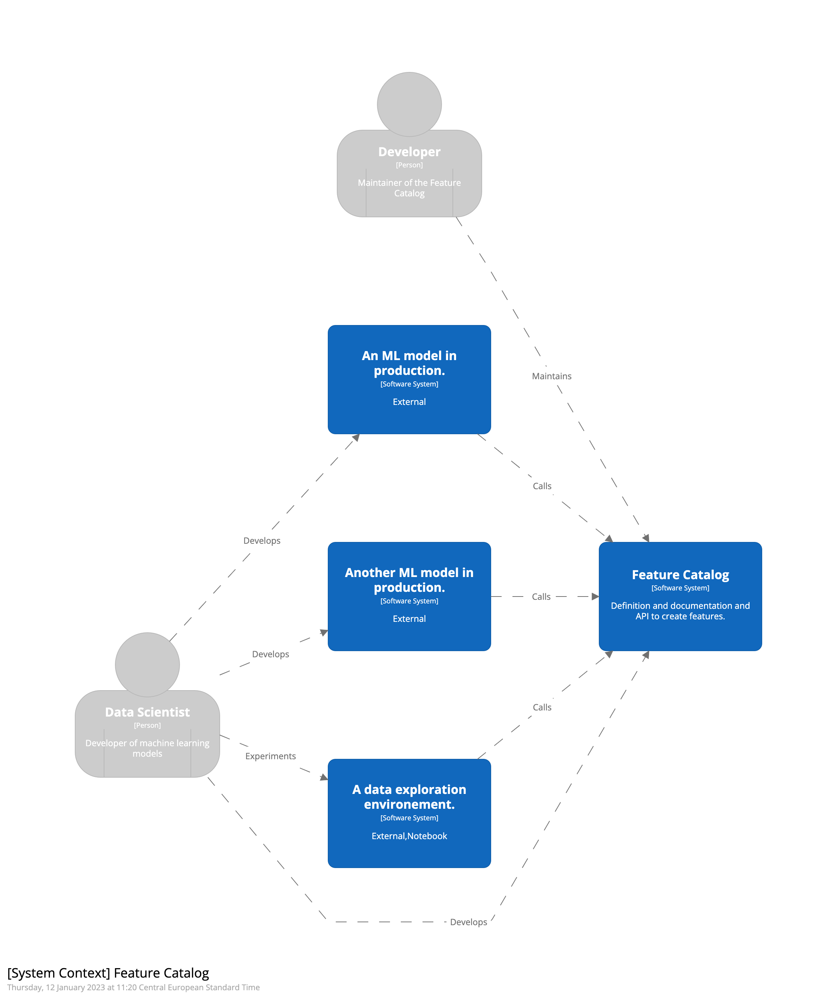
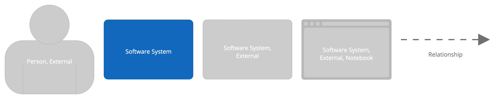

# Feature Catalog

This repo can be used as template or inspiration to create your own feature catalog.
It contains some example code to define your features and expose them to users via a simple API.

Note: this example assumes that the size of your data justifies the use of Spark.

## What is a Feature Catalog?

A Feature Catalog is a place where you define and document your features such that they can be created via an API.

Note that this not (yet) includes the storage of the features in a Feature Store. A Feature Catalog already gives you a lot of benefits without the complexity of a Feature Store or a full Feature Platform.

## Why create a Feature Catalog?

By creating a Feature Catalog you:

- define your features once (single source of truth)
- allow re-use of features across teams and projects (better collaboration)

By increasing collaboration you will get the following benefits:

- increase in speed of development (easy to re-use code)
- increase in reliability / quality of code (more contributors)

## Architecture

The full architecture can be found in the docs folder, but here is already the overview of the system contect.



## How to use

### Install package

Install using `poetry install`.

### Download example data

```bash
curl https://storage.googleapis.com/shareddatasets/wow.parquet -o data/wow.parquet
```

### Run example notebook

After downloading the example data and installing the package you can run the example notebook `example_usage.ipynb`.
