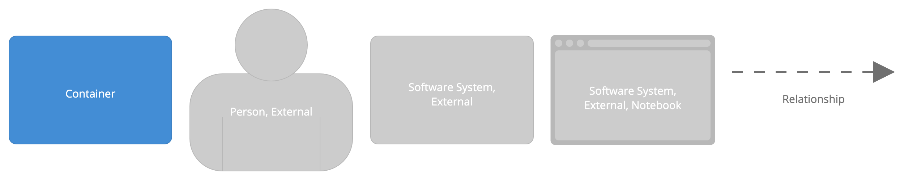
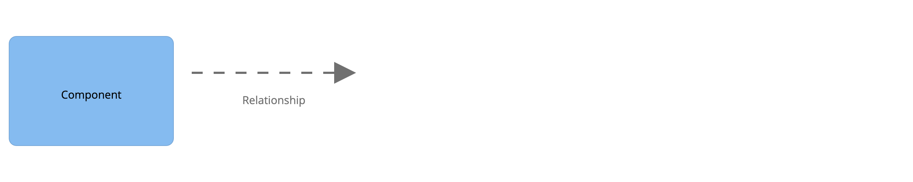

This folder contains the code to visualize the architecture using the [C4 model](https://c4model.com/).
It makes use of the [Structurizr DSL](https://structurizr.com/).

We focus on the following three levels of the architecture: the Context, Container and Component level.  

# Context

# Container

# Component

