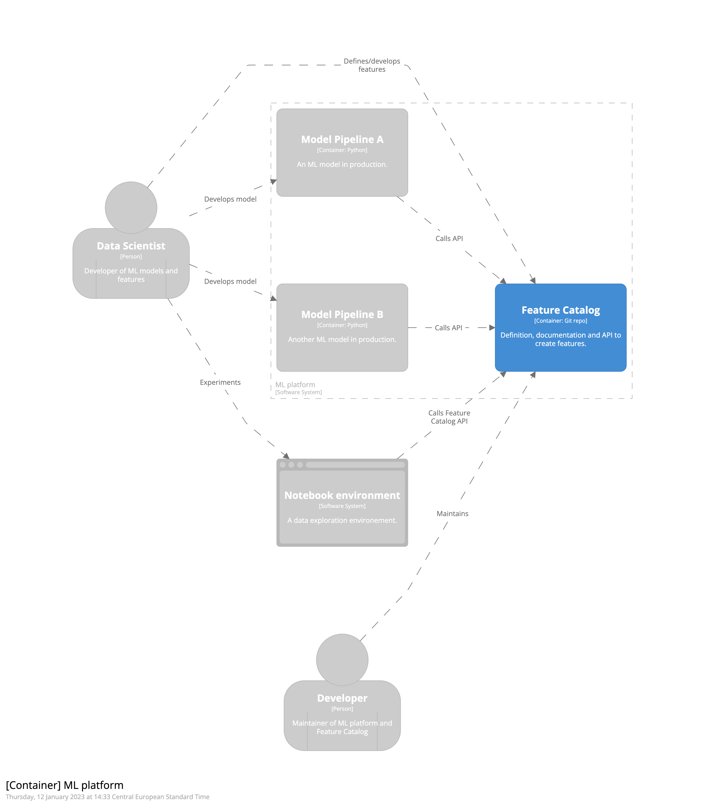
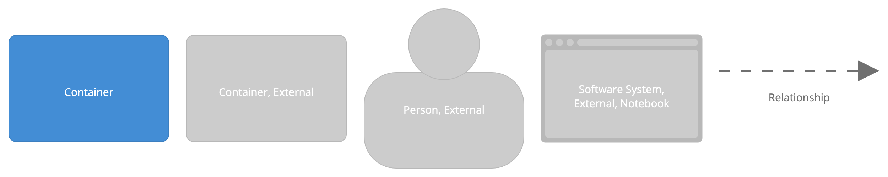
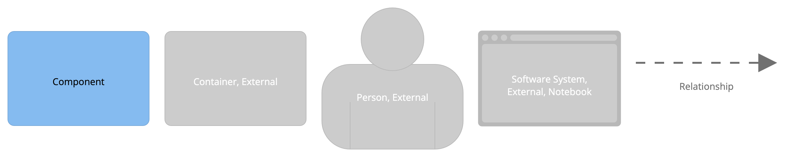
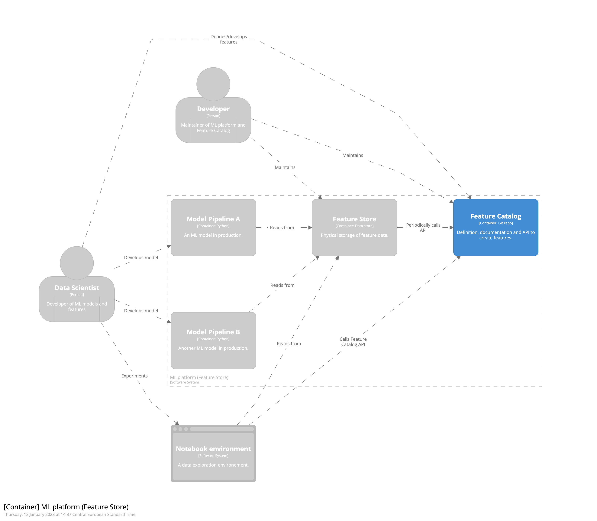

# Architecture overview

This folder contains the code to visualize the architecture using the [C4 model](https://c4model.com/).
It makes use of the [Structurizr DSL](https://structurizr.com/).

To create the diagrams you must have a structurizr account and then run
```
structurizr-cli push -w docs/feature_catalog_architecture.dsl -id <ID> -key <KEY> -secret <SECRET>
```
where you fill in the ID, KEY and SECRET from your account.

We compare the design of using only a Feature Catalog with another design where you also use a Feature Store.

## Only Feature Catalog

### Context overview


### Container overview





### Component overview





## Including Feature Store
### Container overview


